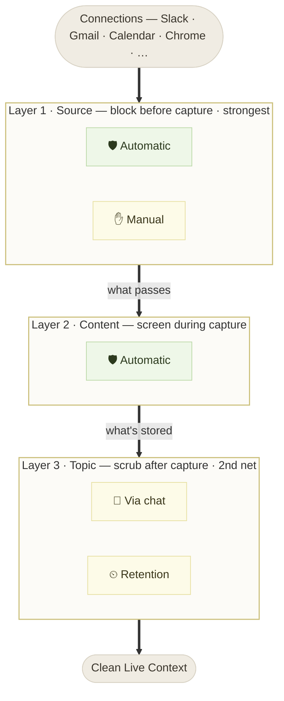

# Ilwon Yoon — onsite

> My take on the Highlight take-home: what I think the real problem is, the one
> idea everything hangs on, and how I built around it. The detailed specs are in
> the other docs; this is the argument.

---

## Why this matters — the one idea

**Highlight is a shared intelligence layer.** And an intelligence layer is only
as good as the data it runs on. That cuts both ways, and both extremes hurt the
product, the business, *and* the user:

- **Too much data** → the AI gets slower (more noise to process), costs go up,
  and the user's privacy anxiety climbs — every extra thing captured is one more
  thing to worry about.
- **Too little data** → the assistant isn't smart enough to be worth using.

So the goal isn't "capture everything" and it isn't "capture as little as
possible." It's **rich, but just enough** — exactly the data that makes the
assistant intelligent, and nothing that makes it slower, costlier, or less
trusted.

> **Rich-but-just-enough data is what delivers speed, performance, trust, and
> security — all at once.**

That reframes privacy completely. Privacy here is **not a wall that subtracts
from intelligence.** It's the **curation that keeps the intelligence layer at its
best.** Filtering isn't defense — it's tuning.

---

## The picture: a three-legged race

The clearest way I can describe the Highlight ↔ user relationship is a
**three-legged race.** Two runners, legs tied together. To go fast they have to
cooperate — but cooperation alone isn't enough. **They also have to keep showing
each other how they're each stepping**, or they trip.

- **Highlight's job** is to show its stride: *"I'm collecting only the data that
  helps, and I'm throwing away what doesn't."* That visibility is what earns the
  next step of trust.
- **The user's job** is to show theirs: *"this should be in, this should be
  out"* — the boundaries only they know.

Neither runner can optimize alone. The whole thing only gets faster when each can
see how the other is moving.

**And that makes us — the people building Highlight — the coach.** We stand
beside the race, watching the small motions: what got captured, what slowed
things down, what the user pulled back. We read those signals and keep tuning
toward the **best-performance combination** — the rhythm where the two runners go
fastest together. The privacy surface is where that coaching happens in the
product: it makes both strides visible so the pair can keep improving.

---

## The reframe — from "Memory management" to data curation

The brief asks for a "Memory" interface — edit, curate, delete sensitive moments.
I could have built a clean CRUD dashboard over captured items. I think that
misses the hard problem.

**Brief only gets powerful with more data — and security-conscious users won't
hand that over all at once.** They connect the safe minimum (calendar, email,
meetings) and hold back the rest (clipboard, screen, Slack, code). So the real
challenge isn't *managing* what's captured. It's:

> **How do you dissolve privacy concern so the user keeps expanding what they
> connect — and rides that into the power-user experience?**

That's why I designed privacy as the **growth engine**, not a settings panel:

```
TRUST (the system proves daily it protects you)
   → CONTROL (redraw any boundary anytime, by talking)
      → richer context → better briefs & actions
         → grant MORE permission → more usage → conversion
            → connect the next source ↺
```

Casual and power users aren't two personas — they're the **same person early vs.
late on one trust ladder.** Casual lives on automatic protection; power has
connected more and drawn their own lines. The design's job is the ramp between
them.

---

## The model — defense-in-depth along the capture pipeline

Privacy isn't one switch. It's a **layered set of defenses along the
data-capture pipeline, strongest at the source.** The earlier you stop sensitive
data, the stronger the protection — data blocked at the source never enters the
system; data caught later was already captured and has to be scrubbed.



Two things this frame makes clear:

1. **Strength = where you stop it.** Layer 1 (source) is strongest — the data is
   never captured. Layer 2 (content) catches what slips through. Layer 3 (topic)
   is the *secondary* net: it acts on data **already captured**, so it can only
   *scrub* — remove what's there, and either stop future capture or auto-expire
   it. That's why "forget anything about X" sits at the bottom, not the top.

2. **Automatic and manual run at every layer — they aren't separate buckets.**
   The old "automatic vs. user filters" split was wrong. The real split is
   **where in the pipeline** the block happens; both the service (automatic) and
   the user (manual) act at each defensible point.

| Layer | Blocks | Automatic | Manual | Input |
|---|---|---|---|---|
| **1 · Source** | before capture | pre-blocks known-risky connections (banking/health/auth, password apps) | exclude an app, site, or channel | a list (concrete) |
| **2 · Content** | during capture | drops secrets & obvious sensitive content that got through | — | none |
| **3 · Topic** | after capture | — | "keep X out" by topic + how long to keep it | **chat** (abstract) |

**Why the manual input differs by layer:** a source is *concrete* — you can name
an app or site, so it's a list (Layer 1). A topic is *abstract* — "what should I
even block?" is hard to answer cold, and the right keywords are hard to recall —
so the assistant does the work: you describe the boundary in words, it scans
what's captured and proposes the matches (Layer 3, via chat). The input matches
the unit.

---

## What I built

- **Data & Privacy** — the manual control surface (Path B). Automatic protection
  shown for transparency (read-only), the user's own filters editable, each with
  a *filtered count* — the proof it's working, never the blocked content.
- **The AI chat panel** — the conversational surface (Path A). The same settings,
  edited by talking. *"Who manually controls settings anymore? You tell the AI."*
  It briefs you on what's protected, then turns a spoken wish into a filter:
  describe a boundary → it scans the real data → shows the hits → you curate →
  pick a duration → the filter is created.
- **The reading surface (Live Context / the Brief)** — context as a living
  document, not a dashboard: a real type system, warm-paper foundation, inline
  source provenance. The craft is the trust signal — a privacy product has to
  *feel* trustworthy.

*(Screens in the gallery; the full conversation + filter design in the privacy
docs.)*

---

## Trade-offs & what's next

- **The deliberate trade-off:** I did **not** center this on a deletion/hygiene
  dashboard. Privacy-as-hygiene produces a defensive product nobody opens twice.
  Privacy-as-the-tuning-of-an-intelligence-layer produces one that compounds —
  and it answers the brief's "complexity without complexity" by keeping
  complexity in the model and the UI a sentence.
- **The mock is deliberate, too.** The scan/keyword work would be a Claude call
  in production; the prototype keeps it on-device and mock — because a privacy
  feature whose first act is shipping your captured data to a cloud model is in
  tension with its own promise. The *experience* is built to completion; the API
  is documented as a one-seam future.
- **Next:** the org/team layer — today the rules are personal; the same model
  extends to an org drawing hard lines once (confidential clients, comp channels,
  data-room domains) with individuals getting lightweight control within those
  guardrails. Out of scope for two days, but the architecture points at it.
